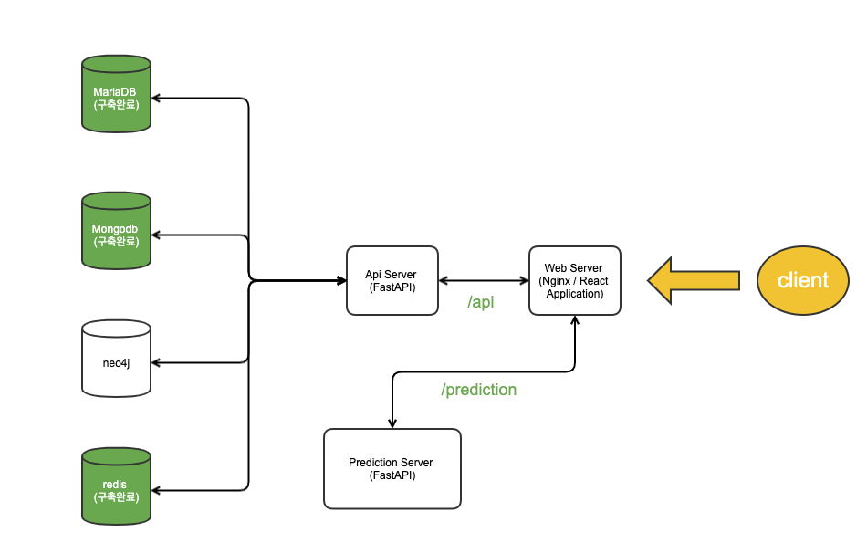

# 컨테이너 기반 FastAPI 디비연동

## Architecture



### k8s 실행

```bash
$ cd k8s

$ ./deploy.sh
```

api 파드는 디비와 의존적이기 때문에 STATUS가 ERROR이 될 수 있다. 쿠버네티스는 이를 주기적으로 다시 실행시켜 Running 상태가 된다.

사용중인 이미지는 deployment 이름 / (프로젝트 경로) : (이미지명:버전)
api        (/api)      : pjt3591oo/fastapi-tutorial:0.2
cnn-serve  (/cnn-serve): pjt3591oo/cnn-serve-tutorial:0.2
cnn-client (/front)    : pjt3591oo/cnn-client-tutorial:0.3 

```bash
$ kubectl get deployment
NAME                 READY   UP-TO-DATE   AVAILABLE   AGE
api                  3/3     3            3           6m2s
cnn-client           1/1     1            1           6m2s
cnn-serve            3/3     3            3           6m2s
mongodb-deployment   1/1     1            1           6m3s
mysql                1/1     1            1           6m3s
redis                1/1     1            1           6m2s
```

모든 파드가 Running이 되면 ingress를 구동한다.

```bash
$ cd ./ingress
$ ./apply.sh
```

```bash
# ingress 조회
$  kubectl get ingress
NAME           CLASS   HOSTS   ADDRESS   PORTS   AGE
mung-ingress   nginx   *                 80      37s

# 서비스 조회
$ kubectl get svc -n ingress-nginx
NAME                                 TYPE        CLUSTER-IP     EXTERNAL-IP   PORT(S)                      AGE
ingress-nginx-controller             NodePort    10.99.238.63   <none>        80:32561/TCP,443:30190/TCP   4m40s
ingress-nginx-controller-admission   ClusterIP   10.109.69.74   <none>        443/TCP                      4m40s
```

./ingress/ingress.yaml에 우리가 만든 인그레스를 위한 서비스를 포트포워드하여 외부에서 접속가능하게 한다.

```bash
$ sudo kubectl port-forward -n ingress-nginx svc/ingress-nginx-controller -n ingress-nginx 80:80
```

[호스트 포트]:[파드 서비스 포트] 

localhost:80으로 접속하면 접속이 가능하다.

### docker-compose 실행

* running

```bash
$ docker-compose up

$ docker-compose ps  
       
     Name                     Command               State            Ports          
--------------------------------------------------------------------------------------
api.fastapi.com      uvicorn main:app --host 0. ...   Up      0.0.0.0:4000->80/tcp    
api.prediction.com   uvicorn server:app --host  ...   Up      0.0.0.0:4100->80/tcp    
db.maria.com         docker-entrypoint.sh mariadbd    Up      0.0.0.0:3306->3306/tcp  
db.mongodb.com       docker-entrypoint.sh mongod      Up      0.0.0.0:27017->27017/tcp
db.redis.com         docker-entrypoint.sh redis ...   Up      0.0.0.0:6379->6379/tcp  
front.react.com      /docker-entrypoint.sh ngin ...   Up      0.0.0.0:80->80/tcp 
```

http://127.0.0.1

http://127.0.0.1/docs

api.fastapi.com와 api.prediction.com은 front.react.com에서 동작중인 nginx에서 L7 수준에서 라우팅 된다.

docker-compose up 시 api, font 이미지가 없다면 생성

만약 api, font 코드가 수정되었다면 기존에 생성된 이미지를 지우고 up 수행(docker-compose의 build에 의해 이미지가 없다면 이미지를 생성)

api.fastapi.com은 환경변수 api/.product.env 적용

front.react.com은 환경변수 front/.product.env 적용

* api 서버 로컬 개발모드

```bash
$ docker-compose up db.mongodb.com db.maria.com db.redis.com api.prediction.com

$ docker-compose ps  
     Name                    Command               State            Ports          
-----------------------------------------------------------------------------------
db.maria.com         docker-entrypoint.sh mariadbd    Up      0.0.0.0:3306->3306/tcp  
db.mongodb.com       docker-entrypoint.sh mongod      Up      0.0.0.0:27017->27017/tcp
db.redis.com         docker-entrypoint.sh redis ...   Up      0.0.0.0:6379->6379/tcp  
api.prediction.com   uvicorn server:app --host  ...   Up      0.0.0.0:4100->80/tcp    


```

이제 api를 직접 실행한다.

```bash
$ cd api

$ uvicorn main:app --reload
```

환경변수 api/.env을 적용한다.

### API 이미지 빌드

```
$ docker build -t [이미지 이름] ./api
```

### 쿼리 

[MariaDB](./mariadb/README.md)

[MongoDB](./mongodb/README.md)